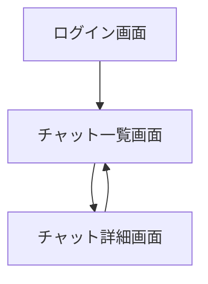

# 基本設計書

## 1. 概要
### 1.1 背景
- 近年、自然言語処理技術の発展により、LLMを活用したチャットアプリが広く普及している。
- これらのアプリでは、用途に応じて複数のモデルを使い分けたり、システムプロンプトを変更して応答の性質を制御するケースが増えている。
- しかし、一般的なチャットアプリではモデルやシステムプロンプトの管理が十分に整理されておらず、用途ごとに設定を切り替えることが煩雑になりやすいという課題がある。
- そのため、モデルおよびシステムプロンプトを会話単位で管理・切り替え可能とし、効率的に利用できる環境が求められている。
### 1.2 目的
- 本アプリは、LLM APIを活用したチャットアプリを作成することを目的とする。
- 複数のモデルやシステムプロンプトを用途に応じて使い分ける際の管理の煩雑さを解消する。
- 会話単位でモデルおよびシステムプロンプトを管理・再利用可能とすることで、効率的なチャット利用環境を提供する。
- また、本アプリの開発を通じて、フロントエンドとバックエンドを分離したWebアプリケーションの設計および実装スキルの習得を目的とする。
### 1.3 対象ユーザー
- 本アプリの対象ユーザーは、LLMを活用したチャットを日常的に利用する単一ユーザーとする。
- 特に、モデルの切り替えやシステムプロンプトを用途に応じて使い分けたいユーザーを主な対象とする。
### 1.4 スコープ
- ログイン/ログアウト
- チャット作成
- 会話履歴の保存
- チャットの削除
- チャット一覧表示
- システムプロンプトの保存・編集
- モデル切り替え
- 会話タイトルの自動生成
- ストリーミング表示
- チャットのピン留め
- セッション単位の会話分離
- トークン数および概算コスト表示
### 1.5 対象外
- 複数人が同時使用を想定した運用
- オートログイン
- 課金機能
- 添付ファイルのアップロード
- ベクトル検索やRAG
- 管理者画面
- 音声入力や画像入力
- 本格監視基盤
### 1.6 前提・制約
- 本アプリは単一ユーザーによる利用を前提とする。
- MVP段階では高負荷・高トラフィック環境は想定しない。
- データベースにはPostgreSQLを使用する。
- LLMの応答は外部API（OpenAI互換API）に依存する。
- APIキーは環境変数で管理し、ソースコードには含めない。
- Docker Compose によりローカル環境での起動を前提とする。
- 単一ユーザー利用を前提とするが、認証機能の学習および将来的な拡張性を考慮し、ログイン機能を実装する。
- ストリーミング通信にはSSE（Server-Sent Events）を利用する。

## 2. 技術構成
### 2.1 システム構成
- 本システムは、Frontend、Backend、Database、および外部LLM APIで構成される。
- ユーザーはブラウザを通じてFrontendにアクセスする。
- FrontendはBackendのAPIを呼び出し、認証およびチャットの送受信を行う。
- BackendはDatabaseと連携し、ユーザー情報、会話履歴、システムプロンプトの保存を行う。
- Backendは外部LLM APIを呼び出し、ユーザー入力に対する応答を取得する。
- アプリケーションはDocker Composeにより一括で起動できる構成とする。
- 各コンポーネントはHTTP通信を用いて連携する。
### 2.2 使用技術
- Frontend: Next.js
- Backend: FastAPI
- DB: PostgreSQL
- ORM: SQLAlchemy
- API: OpenAI互換API
- Infra: Docker Compose
### 2.3 採用理由
- Next.jsの選定理由
  ・Reactベースであり、コンポーネント指向のUI開発が可能であるため
  ・LLMチャットアプリの実装例や情報が多く、開発時の参考資料が豊富であるため
  ・Route HandlerによりAPIエンドポイントの実装も可能であり、柔軟な構成を取れるため
  ・Vercel AI SDKとの相性が良く、ストリーミング対応などの実装が容易であるため
  ・認証・データベース・デプロイに関するエコシステムが充実しているため
  ・フロントエンドとバックエンドを分離した構成を前提としつつ、拡張性のある構成が可能であるため
- FastAPIの選定理由
  ・API専用フレームワークとして設計されており、フロントエンドと分離した構成を取りやすいため
  ・Pythonベースであり、LLM関連ライブラリとの親和性が高いため
  ・非同期処理に対応しており、ストリーミング応答との相性が良いため
  ・OpenAPI(Swagger)によるAPIドキュメント自動生成が可能であるため
- SQLAlchemyの選定理由
  ・Python製ORMでありFastAPIとの親和性が高いため
  ・SQLとORMの両方を柔軟に扱えるため
  ・将来的なDB変更にも対応しやすいため

### 2.4 外部連携
- 本システムはOpenAI互換APIと連携し、チャット応答の生成を行う。
- Backendはユーザー入力および会話履歴をもとに外部LLM APIへリクエストを送信する。
- ストリーミング応答を受信した場合は、Frontendへ逐次転送する。
- APIキーは環境変数から取得する。
#### 連携方式
- 通信方式：HTTPS
- データ形式：JSON

#### 責務分担
- Frontend（Next.js）
  ・ログイン画面およびチャット画面を提供する
  ・Backend APIを呼び出してデータ取得・更新を行う
  ・ストリーミング応答を逐次表示する
  ・Markdownおよびコードブロックを整形表示する

- Backend（FastAPI）
  ・認証および認可を行う
  ・会話セッションおよびメッセージを管理する
  ・外部LLM APIへのリクエスト生成を行う
  ・レート制限およびエラーハンドリングを行う

- Database（PostgreSQL）
  ・ユーザー情報を保持する
  ・会話履歴およびシステムプロンプトを保持する
  ・会話状態やコスト情報を永続化する

- 外部LLM API
  ・入力プロンプトに基づく応答生成を行う
  ・ストリーミング応答を返却する

### 2.5 環境変数管理方針
- 環境差分は.envで管理する
- APIキーやDB接続情報は環境変数から取得する
- .envはGit管理対象外とする
- 起動に必要な環境変数を記載した .env.example を配置する。
- BackendおよびFrontendは、それぞれ必要な環境変数を個別に管理する。
- 本番環境では環境変数をコンテナ実行環境から注入することを想定する。

## 3. 機能一覧
| 機能ID | 機能名 | 概要 | 優先度 | MVP対象 |
|---|---|---|---|---|
|F-01   | ログイン | メールアドレスとパスワードでログインする | High | ○
|F-02	| 会話作成 | 新規チャットセッションを作成する | High | ○
|F-03   | 会話取得 | セッションIDを指定して会話詳細を取得する |　High | ○
|F-04	| 会話一覧表示 | 保存済み会話を一覧表示する | High | ○
|F-05	| 会話検索 | 会話タイトルで検索する | Medium | ○
|F-06	| 会話削除 | 会話を論理削除する | Medium | ○
|F-07	| 会話ピン留め | 会話を一覧上部へ固定表示する | Low | ○
|F-08	| メッセージ送信 | ユーザー入力を送信する | High | ○
|F-09	| LLM応答表示 | LLM応答を画面表示する | High | ○
|F-10	| ストリーミング表示 | 応答を逐次表示する | High | ○
|F-11	| 会話履歴保存 | メッセージ履歴をDBへ保存する | High | ○
|F-12	| モデル切替 | 使用するLLMモデルを変更する | Medium | ○
|F-13	| システムプロンプト設定 | 会話ごとにシステムプロンプトを設定する | Medium | ○
|F-14	| Markdown表示 | Markdown形式でメッセージ表示する | Medium | ○
|F-15	| コードブロック整形 | コードを見やすく表示する | Medium | ○
|F-16	| タイトル自動生成 | 会話タイトルを自動生成する | Low | ○
|F-17	| トークン数表示 | 概算トークン数を表示する | Low | ○
|F-18	| 概算コスト表示 | 概算コストを表示する | Low | ○
|F-19	| エラー表示 | API失敗時にエラー表示する | High | ○
|F-20	| レート制限 | 短時間連続送信を制限する | Low | ○
|F-21	| ヘルスチェック | システム稼働確認APIを提供する | Low | ○

## 4. 画面設計
### 4.1 画面一覧
| 画面ID | 画面名      | 役割              | MVP対象 |
| ---- | -------- | --------------- | ----- |
| S-01 | ログイン画面   | ユーザー認証を行う       | ○     |
| S-02 | チャット一覧画面 | 会話セッションの一覧表示・管理 | ○     |
| S-03 | チャット詳細画面 | メッセージ送受信・履歴表示・設定操作 | ○ |
| S-04 | エラー画面    | エラー発生時の表示       | ○     |

### 4.2 画面遷移
- 未認証状態でアクセスした場合はログイン画面へリダイレクトする
- ログイン成功時はチャット一覧画面へ遷移する
- チャット一覧画面から任意の会話を選択するとチャット詳細画面へ遷移する
- チャット詳細画面から一覧画面へ戻ることができる


### 4.3 画面詳細
#### 画面名
- 役割
- 主な表示項目
- 主な操作
- バリデーション概要

## 5. 機能設計
### 5.1 認証
#### 概要
 -本システムでは、メールアドレスおよびパスワードによる認証を行う。
 -認証済みユーザーのみチャット機能へアクセス可能とする。
 -未認証状態で保護対象画面へアクセスした場合はログイン画面へリダイレクトする。

#### 認証方式
 -認証方式にはJWT（JSON Web Token）を利用する。
 -JWTはHttpOnly Cookieとして保存する。
 -FrontendはCookieを利用して認証状態を維持する。
 -CookieにはSecure属性およびSameSite属性を付与する。

#### ログイン処理
 -ユーザーはメールアドレスおよびパスワードを入力してログインを行う。
 -Backendは入力値を検証し、DBに保存されたユーザー情報と照合する。
 -パスワードはハッシュ化して保存し、平文では保持しない。
 -認証成功時はJWTを発行し、Cookieへ設定する。
 -認証失敗時はエラーメッセージを返却する。
 -ログアウト処理
 -ログアウト時はCookie内のJWTを削除する。
 -ログアウト後は認証が必要な画面へアクセスできない。

#### 認可
 -Backend APIではJWTを検証し、認証済みユーザーのみアクセス可能とする。
 -他ユーザーの会話データへアクセスできないよう、ユーザーIDによるアクセス制御を行う。

#### パスワード管理
 -パスワードはbcrypt等のハッシュ関数を利用して保存する。
 -パスワードの平文保存は行わない。

#### セッション管理
 -JWTには有効期限を設定する。
 -有効期限切れ時は再ログインを要求する。

#### エラー処理
 -認証失敗時は401 Unauthorizedを返却する。
 -認可エラー時は403 Forbiddenを返却する。
 -JWT無効時はログイン画面へ遷移させる。

### 5.2 会話管理
#### 概要
 -本システムでは、会話を「チャットセッション」として管理する。
 -ユーザーは複数の会話を作成し、それぞれ独立した履歴を保持できる。
 -会話ごとに使用モデルおよびシステムプロンプトを保持する。

 #### 会話作成
 -ユーザーは新規会話を作成できる。
 -新規作成時に以下の情報を保持する。
  ・タイトル
  ・使用モデル
  ・システムプロンプト
 -タイトル未設定時は仮タイトルを設定する。

 #### 会話取得
 -ユーザーは会話一覧を取得できる。
  ・一覧には以下の情報を表示する。
  ・タイトル
 -最終更新日時
 -ピン留め状態
 -会話詳細取得時は、会話に紐づくメッセージ履歴を取得する。

#### 会話一覧表示
 -会話一覧は更新日時順で表示する。
 -ピン留めされた会話は一覧上部へ表示する。
 -論理削除済み会話は一覧に表示しない。

#### 会話検索
 -ユーザーはタイトルによる部分一致検索を行える。
 -検索対象は未削除の会話のみとする。

#### 会話更新
 -ユーザーは会話タイトルを変更できる。
 -使用モデルおよびシステムプロンプトを更新できる。
 -更新時は updated_at を更新する。

#### 会話削除
 -会話削除は論理削除方式とする。
 -削除時は deleted_at に日時を設定する。
 -論理削除された会話は通常操作から参照できない

#### ピン留め
 -ユーザーは会話をピン留めできる。
 -ピン留め状態はセッション単位で保持する。
 -ピン留めされた会話は一覧上部へ表示する。

#### タイトル自動生成
 -一定数のメッセージ送信後、LLMを利用して会話タイトルを自動生成する。
 -タイトル未設定時のみ自動生成を行う。
 -自動生成されたタイトルはユーザーが後から編集可能とする。

#### アクセス制御
 -ユーザーは自身が作成した会話のみ参照・更新・削除できる。
 -Backendでは user_id によりアクセス制御を行う。

### 5.3 メッセージ送受信
#### 概要
 -ユーザーは会話セッション単位でメッセージを送信できる。
 -Backendは会話履歴およびシステムプロンプトを含めて外部LLM APIへリクエストを送信する。
 -LLMから取得した応答は会話履歴として保存する。

#### メッセージ送信
 -ユーザーはチャット入力欄からメッセージを送信する。
 -送信対象の会話セッションIDを指定してBackend APIへリクエストを行う。
 -空文字のみのメッセージは送信不可とする。

#### メッセージ保存
 -ユーザー送信メッセージは chat_messages テーブルへ保存する。
 -メッセージには以下の情報を保持する。
  ・session_id
  ・role
  ・content
  ・sequence
  ・status
  ・created_at
#### role管理
 -メッセージには role を持たせる。
 -role は以下を使用する。
  ・system
  ・user
  ・assistant
 -system role は会話ごとのシステムプロンプトとして扱う。

#### 会話履歴構築
 -LLM API呼び出し時は、対象会話の履歴を時系列順で取得する。
 -会話履歴には以下を含める。
  ・system prompt
  ・user message
  ・assistant message
 -論理削除済みデータは含めない。

#### LLM API呼び出し
 -Backendは会話履歴をもとに外部LLM APIへリクエストを送信する。
 -使用モデルは会話セッションに設定された model_name を利用する。
 -API通信はHTTPSを利用する。

#### assistant応答処理
 -LLM応答受信後、assistant メッセージとして保存する。
 -ストリーミング時は逐次受信した内容をFrontendへ転送する。
 -応答完了後、status を completed に更新する。

#### メッセージ状態管理
 -メッセージ状態は status カラムで管理する。
 -status は以下を使用する。
  ・pending
  ・streamed
  ・completed
  ・failed

#### sequence管理
 -メッセージ順序管理のため sequence を保持する。
 -会話履歴取得時は sequence 昇順で取得する。

#### 更新日時管理
 -メッセージ送信時は対応する chat_session の updated_at を更新する。
 -最新メッセージを持つ会話が一覧上位へ表示される。

#### トークン数・コスト情報
 -メッセージ送信時に概算トークン数を算出する。
 -モデル単価テーブルをもとに概算コストを計算する。
 -算出結果はメッセージ単位で保存する。

#### エラー処理
 -LLM API呼び出し失敗時は failed 状態へ更新する。
 -Frontendへエラーメッセージを返却する。
 -通信失敗時でもユーザー入力メッセージは保持する。

#### アクセス制御
 -ユーザーは自身の会話セッションに対してのみメッセージ送信可能とする。
 -Backend側で session.user_id を検証する。

### 5.4 ストリーミング
#### 概要
 -本システムでは、LLM応答を逐次表示するためにストリーミング通信を利用する。
 -ユーザーは応答全文の生成完了を待たずに内容を確認できる。
 -ストリーミング通信にはSSE（Server-Sent Events）を利用する。

#### 通信方式
 -FrontendはBackendへストリーミングリクエストを送信する。
 -Backendは外部LLM APIから受信したトークンを逐次Frontendへ転送する。
 -通信形式には text/event-stream を使用する。

#### ストリーミング処理フロー
 1.ユーザーがメッセージ送信を行う
 2.BackendがuserメッセージをDBへ保存する
 3.Backendがassistantメッセージを pending 状態で生成する
 4.BackendがLLM APIへストリーミングリクエストを送信する
 5.受信したトークンを逐次Frontendへ転送する
 6.Frontendは受信内容をリアルタイム表示する
 7.応答完了後、assistantメッセージを completed 状態へ更新する

#### assistantメッセージ管理
 -ストリーミング開始時に assistant メッセージレコードを作成する。
 -ストリーミング中は受信済みテキストを逐次更新する。
 -完了時に最終内容を保存する。

#### 状態管理
 -ストリーミング中のメッセージは streamed または pending 状態とする。
 -正常終了時は completed へ更新する。
 -エラー発生時は failed へ更新する。

#### Frontend表示
 -Frontendは受信したテキストを逐次描画する。
 -Markdown整形はストリーミング中も可能な範囲で適用する。
 -応答中はローディング状態を表示する。

#### 接続エラー処理
 -通信切断時はエラーメッセージを表示する。
 -Backendとの接続失敗時はストリーミングを中断する。
 -failed 状態のメッセージは再送信可能とする。

#### タイムアウト
 -長時間応答が返らない場合はタイムアウトとする。
 -タイムアウト時は failed 状態へ更新する。

#### 更新日時管理
 -ストリーミング完了時に chat_sessions.updated_at を更新する。

#### 制約事項
 -MVP段階では1会話につき同時送信は1件までとする。
 -複数同時生成には対応しない。

### 5.5 モデル管理
#### 概要
 -本システムでは、会話ごとに使用するLLMモデルを設定できる。
 -ユーザーは用途に応じてモデルを切り替えて利用できる。
 -モデル設定は会話セッション単位で保持する。

#### モデル設定
 -会話セッションには model_name を保持する。
 -新規会話作成時にはデフォルトモデルを設定する。
 -ユーザーは画面上から使用モデルを変更できる。

#### 利用可能モデル
 -Backendは利用可能なモデル一覧を提供する。
 -Frontendは取得したモデル一覧を選択UIへ表示する。
 -MVP段階では固定のモデル一覧をBackend側で管理する。

#### モデル適用
 -メッセージ送信時は、会話セッションに設定された model_name を利用してLLM APIを呼び出す。
 -モデル変更後は次回メッセージ送信時から新モデルを適用する。

#### モデル情報管理
 -モデルごとに以下の情報を保持可能とする。
  ・モデル名
  ・表示名
  ・入力単価
  ・出力単価
  ・最大コンテキスト長

#### バリデーション
 -利用可能モデル一覧に存在しないモデルは設定不可とする。
 -不正なモデル指定時はエラーを返却する。

#### コスト計算との連携
 -モデルごとの単価情報を利用して概算コストを算出する。
 -コスト表示は参考値として扱う。

#### 将来的な拡張性
 -Backend内部ではLLM Provider層を設け、OpenAI互換APIへの依存を抽象化する。
 -将来的なモデル追加やProvider変更に対応可能な構成とする。

### 5.6 システムプロンプト管理
#### 概要
 -本システムでは、会話ごとにシステムプロンプトを設定できる。
 -システムプロンプトにより、LLMの応答方針や振る舞いを制御する。
 -システムプロンプトは会話セッション単位で保持する。

#### システムプロンプト設定
 -ユーザーは会話ごとにシステムプロンプトを入力・編集できる。
 -システムプロンプトは chat_sessions.system_prompt に保存する。
 -未設定時はデフォルトシステムプロンプトを利用する。

#### デフォルトシステムプロンプト
 -新規会話作成時はデフォルトシステムプロンプトを設定する。
 -デフォルト値は環境変数またはBackend設定値から取得する。

#### LLM APIへの適用
 -メッセージ送信時は、システムプロンプトを role=system として会話履歴の先頭へ追加する。
 -システムプロンプトは毎回LLM APIへ送信する。

#### 更新処理
 -システムプロンプト変更後は次回メッセージ送信時から適用する。
 -更新時は chat_sessions.updated_at を更新する。

#### バリデーション
 -システムプロンプト未入力は許容する。
 -最大文字数を設定し、過剰な入力を防止する。

#### 表示
 -Frontendでは現在設定中のシステムプロンプトを確認・編集できる。
 -長文入力に対応するため複数行入力UIを使用する。

#### セキュリティ
 -システムプロンプトはユーザー入力として扱う。
 -HTMLとしては解釈せず、テキストとして処理する。

#### 将来的な拡張性
 -将来的にはシステムプロンプトテンプレート機能の追加を想定する。
 -テンプレートの保存・再利用には対応しない。

### 5.7 タイトル自動生成
#### 概要
 -本システムでは、会話内容をもとに会話タイトルを自動生成する。
 -タイトル未設定の会話に対して、LLMを利用して要約タイトルを生成する。
 -ユーザーは生成後にタイトルを自由に編集できる。

#### 生成タイミング
 - 一定数のメッセージ送信後にタイトル生成を行う。
 -MVP段階では、初回の user / assistant 応答完了後に生成する。
 -既にタイトルが設定済みの場合は自動生成を行わない。

#### 生成方式
 -Backendが会話履歴の一部を利用してLLM APIへタイトル生成リクエストを送信する。
 -タイトル生成には通常会話用とは別プロンプトを使用する。
 -タイトル生成プロンプト
 -タイトル生成時は簡潔な要約を要求する。
 -長文タイトルの生成を防ぐため文字数制限を設ける。

#### 保存処理
 -生成されたタイトルは chat_sessions.title に保存する。
 -保存時は updated_at を更新する。

#### エラー処理
 -タイトル生成失敗時でも会話機能には影響を与えない。
 -生成失敗時は仮タイトルを維持する。

#### 表示
 -タイトル未生成時は仮タイトルを表示する。
 -タイトル生成完了後、一覧および詳細画面へ反映する。

#### 制約事項
 -MVP段階ではタイトル再生成機能は提供しない。
 -タイトル生成は同期的に実行する。

### 5.8 履歴検索・ピン留め・削除
#### 概要
 -本システムでは、ユーザーが作成した会話履歴に対して検索・ピン留め・削除機能を提供する。
 -これにより、過去の会話へのアクセス性を向上させる。
#### 1. 履歴検索
  ・概要
   -ユーザーは会話タイトルをもとに履歴検索を行える。

  ・検索仕様
   -検索対象は chat_sessions.title とする。
   -部分一致検索（LIKE検索）を行う。
   -大文字・小文字は区別しない。

  ・対象範囲
   -未削除（deleted_at が NULL）の会話のみを対象とする。

  ・表示
   -検索結果は一覧画面に即時反映する。
   -該当なしの場合は「該当データなし」を表示する。

#### 2. ピン留め
  ・概要
   -ユーザーは重要な会話をピン留めできる。

  ・動作仕様
   -ピン留め状態は chat_sessions.pinned で管理する。
   -true の場合、一覧上部に固定表示される。

  ・表示ルール
   -ピン留めされた会話は常に一覧の上位に表示する。
   -ピン留め解除された場合は通常の並び順に戻る。

  ・並び順
   -ピン留め済み：更新日時降順
   -非ピン留め：更新日時降順

#### 3. 削除
  ・概要
   -ユーザーは不要な会話を削除できる。

  ・削除方式
   -削除は論理削除（soft delete）とする。
   -chat_sessions.deleted_at に日時を設定する。

  ・削除後の挙動
   -削除された会話は一覧画面に表示されない。
   -会話詳細へのアクセスは不可とする。

  ・メッセージとの関係
   -会話削除時、関連するメッセージは削除せず保持する。
   -ただし取得時は deleted_at を持つセッションは除外する。

#### 4. アクセス制御
  ・概要
   -ユーザーは自身が作成した会話のみ操作可能とする。

  ・制御内容
   -検索結果・一覧表示・削除対象は user_id によって制御する。
   -他ユーザーのデータにはアクセスできない。

#### 5. 非機能的考慮
  ・パフォーマンス
   -検索はインデックス付きカラム（title）を利用する。
   -将来的なデータ増加を考慮し、LIKE検索の最適化を行う。

  ・制約
   -MVP段階では全文検索エンジンは使用しない。
   -シンプルな部分一致検索のみを採用する。

### 5.9 コスト表示
#### 概要
 -本システムでは、各メッセージおよび会話単位でLLM利用に伴うトークン数および概算コストを表示する。
 -表示されるコストは実際の請求額ではなく、モデル単価に基づく概算値とする。

#### トークン数の計算
 -入力および出力のトークン数をそれぞれ記録する。
 -トークン数はLLM APIのレスポンス情報または推定ロジックにより算出する。
 -メッセージ単位で以下を保持する。
 -input_tokens
 -output_tokens

#### コスト算出方法
 -モデルごとに定義された単価情報を用いて概算コストを算出する。
 -計算式は以下とする。

  コスト =
  (input_tokens × input単価) +
  (output_tokens × output単価)

#### モデル単価管理
 -モデルごとに以下の情報を保持する。
 -input単価
 -output単価
 -単価情報はBackend側で管理する。

#### 表示単位
 -メッセージ単位
 -各メッセージごとにトークン数およびコストを表示可能とする。
 -会話単位
 -会話全体の合計トークン数および合計コストを表示する。

#### 表示内容
 -ユーザー画面には以下を表示する。
 -入力トークン数
 -出力トークン数
 -合計トークン数
 -概算コスト
 
#### 更新タイミング
 -LLM応答完了後にトークン数およびコストを確定する。
 -ストリーミング中は仮値または未表示とする。

#### 精度について
 -本機能は簡易的な概算機能とし、実際の課金額との差異を許容する。
 -厳密な課金計算や請求機能は対象外とする。

#### エラー時の扱い
 -トークン数取得に失敗した場合はコスト表示を省略する。
 -メッセージ送受信機能には影響を与えない。

#### 将来的な拡張性
 -将来的にはトークン計測ライブラリ（tiktoken等）の導入を検討する。
 -モデル追加時にも単価テーブル追加のみで対応可能な構成とする。

### 5.10 エラー処理
#### 概要
 -本システムでは、外部APIや内部処理で発生するエラーを適切にハンドリングし、ユーザーに分かりやすく通知する。
 -エラー発生時でもシステム全体が停止しないように設計する。

#### エラー分類
 -本システムでは以下のエラーを扱う。
  ・認証エラー（401 Unauthorized）
  ・認可エラー（403 Forbidden）
  ・バリデーションエラー（400 Bad Request）
  ・レート制限エラー（429 Too Many Requests）
  ・外部APIエラー（LLM API失敗）
  ・タイムアウトエラー
  ・サーバー内部エラー（500 Internal Server Error）

#### 認証・認可エラー
 -未認証ユーザーのアクセスは 401 を返却する。
 -他ユーザーのリソースアクセスは 403 を返却する。
 -Frontendはログイン画面へ遷移する。

#### バリデーションエラー
 -不正な入力値（空文字・長すぎる文字列など）は 400 を返却する。
 -エラーメッセージは項目単位で返却する。

#### LLM APIエラー
 -外部LLM APIの失敗時はエラーメッセージを返却する。
 -ストリーミング中にエラーが発生した場合は途中までの内容を保持する。
 -assistantメッセージのstatusを failed に更新する。

#### レート制限エラー
 -短時間に過剰なリクエストが送信された場合は 429 を返却する。
 -Frontendには「一定時間後に再試行してください」と表示する。

#### タイムアウト処理
 -LLM API応答が一定時間返らない場合はタイムアウトとする。
 -タイムアウト時は処理を中断し、failedとして扱う。

#### サーバー内部エラー
 -予期しないエラーは 500 として処理する。
 -エラー詳細はログにのみ出力し、ユーザーには汎用メッセージを表示する。

#### Frontendでの表示
 -エラー内容はユーザーが理解できる形で表示する。
 -技術的詳細は表示しない。
 -エラー発生時でも画面遷移は維持する。

#### ストリーミング中のエラー処理
 -ストリーミング中にエラーが発生した場合は接続を中断する。
 -途中まで受信した内容は保持する。
 -再送信可能な状態とする。

#### ログ出力
 -全てのエラーはBackend側でログに記録する。
 -本番環境では機密情報（APIキー等）はログに出力しない。

#### 再試行
 -一部のエラー（ネットワーク・API失敗）は再試行可能とする。
 -再試行はユーザー操作により実行する。

#### 非機能要件
 -エラー発生時もシステム全体は継続稼働すること。
 -ユーザー入力データは可能な限り保持する。

### 5.11 レート制限
#### 概要
 -本システムでは、短時間に過剰なリクエストが送信されることを防ぐためレート制限を実装する。
 -LLM APIの過剰利用防止およびサーバー負荷軽減を目的とする。

#### 制限対象
 -メッセージ送信API（/sessions/{id}/messages）
 -ストリーミングAPI

#### 制限単位
 -レート制限はユーザー単位で行う。
 -user_id を基準に制御する。

#### 制限ルール（MVP）
 -1ユーザーあたり「1分間にN回まで」のリクエストを許可する。
 -MVPでは簡易的にインメモリでカウント管理を行う。
 -将来的にはRedis等の導入を検討する。
（例）1分間に5リクエストまで

#### 制御方法
 -Backendでリクエスト受信時にカウンタをチェックする。
 -制限超過時は処理を中断し、HTTP 429を返却する。

#### レスポンス内容
 -レート制限発生時は以下を返却する：
 -ステータスコード：429 Too Many Requests
 -メッセージ：「リクエストが多すぎます。しばらく時間をおいて再試行してください。」

#### 制限のリセット
 -一定時間（例：60秒）経過後にカウンタをリセットする。

#### ストリーミング時の扱い
 -ストリーミング開始前にレート制限チェックを行う。
 -制限超過時はストリーミングを開始しない。

#### エラー処理
 -レート制限エラー発生時でも他機能には影響しない。
 -ユーザー入力データは保存される場合がある。

#### ログ
 -レート制限発生時はログに記録する。
 -不正アクセス検知の参考情報とする。

#### 将来的な拡張
 -Redisを用いた分散レート制御
 -IP単位 + ユーザー単位の二重制限

## 6. API設計
### API設計
| Method | Path         | 説明          | 認証要否 |
| ------ | ------------ | ----------- | ---- |
| POST   | /auth/login  | ログイン        | 不要   |
| POST   | /auth/logout | ログアウト       | 必要   |
| GET    | /auth/me     | 自分のユーザー情報取得 | 必要   |

### 会話（セッション）
| Method | Path               | 説明                   | 認証要否 |
| ------ | ------------------ | -------------------- | ---- |
| GET    | /sessions          | 会話一覧取得               | 必要   |
| POST   | /sessions          | 新規会話作成               | 必要   |
| GET    | /sessions/{id}     | 会話詳細取得               | 必要   |
| PATCH  | /sessions/{id}     | 会話更新（タイトル・モデル・プロンプト） | 必要   |
| DELETE | /sessions/{id}     | 会話削除（論理削除）           | 必要   |
| POST   | /sessions/{id}/pin | ピン留め切替               | 必要   |

### メッセージ
| Method | Path                           | 説明          | 認証要否 |
| ------ | ------------------------------ | ----------- | ---- |
| GET    | /sessions/{id}/messages        | メッセージ取得     | 必要   |
| POST   | /sessions/{id}/messages        | メッセージ送信（通常） | 必要   |
| POST   | /sessions/{id}/messages/stream | ストリーミング送信   | 必要   |

### 補助系
| Method | Path    | 説明          | 認証要否 |
| ------ | ------- | ----------- | ---- |
| GET    | /models | 利用可能モデル一覧取得 | 必要   |
| GET    | /health | ヘルスチェック     | 不要   |

## 7. データ設計
### 7.1 ER図
```mermaid
graph TD
erDiagram

    users ||--o{ chat_sessions : owns
    chat_sessions ||--o{ chat_messages : contains

    users {
        bigint id PK
        varchar email
        varchar password_hash
        timestamp created_at
        timestamp updated_at
    }

    chat_sessions {
        bigint id PK
        bigint user_id FK
        varchar title
        text system_prompt
        varchar model_name
        boolean pinned
        timestamp deleted_at
        timestamp created_at
        timestamp updated_at
    }

    chat_messages {
        bigint id PK
        bigint session_id FK
        varchar role
        text content
        int sequence
        varchar status
        int input_tokens
        int output_tokens
        float estimated_cost
        timestamp created_at
    }
    
```
### 7.2 テーブル一覧
7.2 テーブル一覧
| テーブル名         | 説明                     | 主な用途        |
| ------------- | ---------------------- | ----------- |
| users         | ユーザー情報を管理するテーブル        | 認証・所有者管理    |
| chat_sessions | チャット会話（セッション）を管理するテーブル | 会話単位の管理     |
| chat_messages | メッセージ履歴を管理するテーブル       | LLMとのやり取り履歴 |

補足テーブル
| テーブル名        | 説明               | 主な用途       |
| ------------ | ---------------- | ---------- |
| models（任意）   | 利用可能なLLMモデル情報を管理 | モデル一覧・単価管理 |
| api_logs（任意） | APIリクエスト履歴       | デバッグ・監視    |

### 7.3 テーブル定義
#### ■ users テーブル
ユーザー情報を管理する。
| カラム名          | 型            | 制約                 | 説明         |
| ------------- | ------------ | ------------------ | ---------- |
| id            | BIGINT       | PK, AUTO_INCREMENT | ユーザーID     |
| email         | VARCHAR(255) | UNIQUE, NOT NULL   | メールアドレス    |
| password_hash | VARCHAR(255) | NOT NULL           | ハッシュ化パスワード |
| created_at    | TIMESTAMP    | NOT NULL           | 作成日時       |
| updated_at    | TIMESTAMP    | NOT NULL           | 更新日時       |

#### ■ chat_sessions テーブル
チャット会話（セッション）を管理する。
| カラム名          | 型            | 制約                 | 説明        |
| ------------- | ------------ | ------------------ | --------- |
| id            | BIGINT       | PK, AUTO_INCREMENT | セッションID   |
| user_id       | BIGINT       | FK, NOT NULL       | 所有ユーザー    |
| title         | VARCHAR(255) | NULL               | 会話タイトル    |
| system_prompt | TEXT         | NULL               | システムプロンプト |
| model_name    | VARCHAR(100) | NOT NULL           | 使用モデル     |
| pinned        | BOOLEAN      | DEFAULT false      | ピン留め状態    |
| deleted_at    | TIMESTAMP    | NULL               | 論理削除日時    |
| created_at    | TIMESTAMP    | NOT NULL           | 作成日時      |
| updated_at    | TIMESTAMP    | NOT NULL           | 更新日時      |

#### ■ chat_messages テーブル
メッセージ履歴を管理する。
| カラム名           | 型           | 制約                 | 説明                                      |
| -------------- | ----------- | ------------------ | --------------------------------------- |
| id             | BIGINT      | PK, AUTO_INCREMENT | メッセージID                                 |
| session_id     | BIGINT      | FK, NOT NULL       | セッションID                                 |
| role           | VARCHAR(20) | NOT NULL           | system / user / assistant               |
| content        | TEXT        | NOT NULL           | メッセージ本文                                 |
| sequence       | INT         | NOT NULL           | 表示順                                     |
| status         | VARCHAR(20) | NOT NULL           | pending / streamed / completed / failed |
| input_tokens   | INT         | NULL               | 入力トークン数                                 |
| output_tokens  | INT         | NULL               | 出力トークン数                                 |
| estimated_cost | FLOAT       | NULL               | 概算コスト                                   |
| created_at     | TIMESTAMP   | NOT NULL           | 作成日時                                    |

### 7.4 インデックス方針
#### 概要
 -本システムでは、検索性能およびリレーション取得性能を向上させるため、必要なカラムに対してインデックスを設定する。
 -特に外部キーおよび検索対象カラムを中心にインデックスを付与する。

#### users テーブル
| カラム   | 理由                             |
| ----- | ------------------------------ |
| email | ログイン時の検索に使用するためUNIQUEインデックスを付与 |

#### chat_sessions テーブル
| カラム        | 理由                     |
| ---------- | ---------------------- |
| user_id    | ユーザーごとの会話一覧取得に使用するため   |
| title      | 検索機能（LIKE検索）に使用するため    |
| deleted_at | 論理削除データを除外するため（NULL検索） |
| pinned     | ピン留め表示のソートに使用するため      |

#### chat_messages テーブル
| カラム        | 理由                  |
| ---------- | ------------------- |
| session_id | 会話ごとのメッセージ取得に使用するため |
| sequence   | メッセージ表示順のソートに使用するため |

#### 複合インデックス（必要に応じて）
 -chat_sessions (user_id, deleted_at)
 -ユーザー単位の未削除会話取得を高速化するため

#### 検索性能に関する方針
 -title検索はLIKE検索を使用するため、必要に応じてインデックスを活用する
 -将来的にデータ量が増加した場合は全文検索（PostgreSQLのtsvector）への移行を検討する

#### 非機能的考慮
 -インデックスは読み取り性能を向上させる一方で書き込み性能に影響するため、必要最小限に留める
 -MVP段階では過剰なインデックスは設定しない

### 7.5 論理削除方針
#### 概要
 -本システムでは、データ削除において物理削除ではなく論理削除（soft delete）を採用する。
 -削除対象データはDB上に残し、削除日時を記録することで復元性およびデータ整合性を担保する。

#### 対象テーブル
 -chat_sessions テーブルに対して論理削除を適用する。
 -chat_messages テーブルは削除対象とせず、履歴保持を優先する。

#### 削除方法
 -chat_sessions.deleted_at に削除日時を設定することで削除状態とする。
 -deleted_at が NULL の場合は「有効データ」として扱う。

#### データ取得時の条件
 -全ての取得処理において以下の条件を必須とする。
 WHERE deleted_at IS NULL

#### 削除時の挙動
 -ユーザーが会話を削除した場合、即時物理削除は行わない。
 -対象レコードの deleted_at を現在日時で更新する。

#### メッセージとの関係
 -chat_sessions を削除しても chat_messages は保持する。
 -セッション削除時にメッセージは参照不可となるが、データ自体は残す。

#### 理由
 -論理削除を採用する理由は以下の通り：
 -誤削除時の復元可能性を確保するため
 -会話履歴やコスト分析などのデータ保持のため
 -外部キー制約による削除連鎖を避けるため
 -将来的な分析・機能拡張に備えるため

#### 非機能的考慮
 -deleted_at を使用したフィルタリングを全APIで統一する
 -インデックス設計と組み合わせて検索性能を維持する
 -論理削除データの肥大化に備え、将来的にアーカイブ機能を検討する

#### 注意事項
 -削除済みデータは通常UIには表示しない
 -管理用途以外での復元機能はMVPでは提供しない

## 8. 非機能要件
### 8.1 性能
#### 概要
 -本システムはMVP段階の単一ユーザー利用を前提とし、一般的なローカル開発環境および小規模利用環境で快適に動作する性能を目標とする。
 -高負荷・大規模同時接続環境は想定しない。

#### 応答性能
 -通常API（ログイン・会話一覧取得・会話作成等）は、平均3秒以内の応答を目標とする。
 -会話履歴取得は、通常利用範囲内において体感的な遅延が発生しないことを目標とする。
 -LLM応答は外部API性能に依存するため、初回トークン受信開始まで数秒程度の遅延を許容する。

#### ストリーミング性能
 -ストリーミング通信では、LLM APIから受信したトークンを逐次Frontendへ転送する。
 -Frontendは受信したテキストをリアルタイムに表示可能とする。
 -ストリーミング中もUI操作が極端に阻害されないことを目標とする。

#### データ件数想定
 -MVP段階では以下程度のデータ量を想定する。
  ・ユーザー数：1〜数名
  ・会話数：数百件程度
  ・メッセージ数：数万件程度
 -上記規模において通常操作に支障が出ない性能を目標とする。

#### DB性能
 -会話一覧取得および会話履歴取得では、必要なインデックスを利用する。
 -N+1問題を避けるため、ORM利用時は適切なリレーション取得を行う。
 -論理削除データを除外した検索を基本とする。

#### 制約事項
 -MVP段階では水平スケーリングは考慮しない。
 -Redis等のキャッシュ機構は導入しない。
 -レート制限は簡易的なインメモリ管理とする。

#### 将来的な拡張性
 -将来的には以下の性能改善を検討する。
  ・Redis導入によるキャッシュ最適化
  ・PostgreSQLチューニング
  ・非同期ジョブキュー導入
  ・分散レート制限
  ・全文検索導入

### 8.2 セキュリティ
#### 概要
 -本システムでは、認証情報・会話履歴・APIキーなどの機密情報を適切に保護する。
 -MVP段階では一般的なWebアプリケーションとして最低限必要なセキュリティ対策を実施する。

#### 認証・認可
 -認証方式にはJWT（JSON Web Token）を利用する。
 -JWTはHttpOnly Cookieとして保存し、JavaScriptから参照不可とする。
 -Cookieには Secure 属性および SameSite 属性を付与する。
 -Backend APIではJWT検証を行い、認証済みユーザーのみアクセス可能とする。
 -user_id によるアクセス制御を行い、他ユーザーの会話へアクセスできないようにする。

#### パスワード管理
 -パスワードはbcrypt等のハッシュ関数を用いて保存する。
 -平文パスワードは保存しない。
 -パスワード比較時はハッシュ値同士で検証を行う。

#### APIキー管理
 -外部LLM APIキーは環境変数で管理する。
 -APIキーをソースコードへ直書きしない。
 -.env はGit管理対象外とする。

#### 通信セキュリティ
 -Frontend / Backend / 外部API間通信はHTTPSを前提とする。
 -本番環境ではTLS通信を利用することを想定する。

#### 入力値検証
 -Backend側で入力値バリデーションを実施する。
 -空文字・不正値・過剰な文字列長を検証する。
 -SQLAlchemy ORMを利用し、SQL Injection対策を行う。

#### XSS対策
 -ユーザー入力はHTMLとして解釈しない。
 -Markdown表示時は危険なHTMLを無効化またはサニタイズする。
 -Frontendでは dangerouslySetInnerHTML の使用を避ける。

#### CSRF対策
 -SameSite Cookie属性を利用し、CSRFリスク軽減を行う。
 -将来的にはCSRFトークン導入を検討する。

#### ログ管理
 -ログにはAPIキー・パスワード・JWTなどの機密情報を出力しない。
 -エラー時も機密情報をレスポンスへ含めない。

#### 権限制御
 -全ての会話・メッセージ操作は user_id により所有者確認を行う。
 -deleted_at を持つ論理削除データは通常アクセス不可とする。

#### レート制限
 -短時間での過剰アクセス防止のため、レート制限を実施する。
 -制限超過時は HTTP 429 を返却する。

#### 将来的な拡張
 -OAuthログイン対応
 -Redisを用いたセッション管理
 -WAF導入
 -監査ログ強化
 -CSP（Content Security Policy）導入

### 8.3 可用性
#### 概要
 -本システムはMVP段階の小規模利用を前提とし、一般的なローカル開発環境および小規模運用環境において継続利用可能な構成を目標とする。
 -高可用性構成や分散構成は対象外とする。

#### サービス継続性
 -Frontend、Backend、DatabaseはDocker Composeにより一括起動可能とする。
 -コンテナ停止時は再起動により復旧可能な構成とする。
 -一部機能でエラーが発生した場合でも、システム全体が停止しないようにする。

#### 外部API障害時の扱い
 -LLM API障害時でもアプリケーション自体は継続稼働する。
 -外部API失敗時はエラーメッセージを表示し、他機能への影響を最小限に抑える。
 -会話履歴およびユーザー入力は可能な限り保持する。

#### データ保全
 -会話履歴およびユーザー情報はPostgreSQLへ永続化する。
 -コンテナ再起動後もデータを保持できるよう、DBデータはVolumeを利用して保存する。
 -論理削除（soft delete）を採用し、誤削除によるデータ消失リスクを軽減する。

#### 障害時の復旧性
 -Backend停止時はコンテナ再起動により復旧可能とする。
 -Database接続失敗時はエラーログを出力する。
 -重大エラー時もプロセス異常終了を最小限に抑える。

#### タイムアウト制御
 -外部LLM APIへのリクエストにはタイムアウトを設定する。
 -長時間応答が返らない場合は処理を中断し、ユーザーへ通知する。

#### ヘルスチェック
 -Backendは /health API を提供する。
 -システム稼働確認および疎通確認に利用する。

#### バックアップ
 -MVP段階では自動バックアップ機能は提供しない。
 -PostgreSQLデータは手動バックアップ可能な構成とする。

#### 制約事項
 -MVP段階では単一構成を前提とする。
 -冗長化構成、ロードバランサ、自動フェイルオーバーには対応しない。
 -PostgreSQLレプリケーションは対象外とする。

#### 将来的な拡張
 -PostgreSQLバックアップ自動化
 -Redis導入
 -コンテナオーケストレーション対応
 -ロードバランシング
 -分散構成対応

### 8.4 ログ
#### 概要
 -本システムでは、障害調査・デバッグ・運用保守を目的としてログを出力する。
 -MVP段階ではBackendを中心に最低限必要なログを記録する。

#### 出力対象
 -以下の情報をログ出力対象とする。
 -APIリクエスト受付
 -認証成功 / 認証失敗
 -エラー発生情報
 -外部LLM API呼び出し結果
 -レート制限発生
 -ストリーミング接続エラー
 -サーバー内部例外

#### ログレベル
 -ログレベルは以下を使用する。
  ・INFO
     ・通常処理
     ・APIアクセス
     ・ログイン成功
  ・WARNING
     ・レート制限
     ・タイムアウト
     ・一時的外部API失敗
  ・ERROR
     ・例外発生
     ・DB接続失敗
     ・外部API重大エラー

#### エラーログ
 -予期しない例外発生時はスタックトレースを記録する。
 -エラー内容はBackend側ログへ記録し、Frontendには汎用メッセージのみ返却する。

#### セキュリティ配慮
 -以下の機密情報はログへ出力しない。
  ・パスワード
  ・JWT
  ・APIキー
  ・Cookie情報
  ・個人情報
 -会話本文は必要最小限のみ記録する。
 -本番環境では機密情報マスキングを考慮する。

#### 外部APIログ
 -LLM API呼び出し時は以下を必要に応じて記録する。
  ・使用モデル
  ・リクエスト時刻
  ・応答ステータス
  ・応答時間
  ・エラー内容
 -会話本文全文の保存は必要最小限とする。

#### ストリーミングログ
 -ストリーミング開始・完了・失敗をログ出力する。
 -接続切断時はエラー内容を記録する。

#### 保存方式
 -MVP段階では標準出力（stdout）へログ出力する。
 -Docker Compose環境では docker logs により確認可能とする。

#### ログローテーション
 -MVP段階では専用ログローテーション機能は導入しない。
 -将来的にはログ管理基盤導入を検討する。

#### 将来的な拡張
 -構造化ログ（JSONログ）
 -ログ集約基盤導入
 -監視ツール連携
 -メトリクス収集
 -トレーシング導入

### 8.5 運用保守
#### 概要
 -本システムでは、開発・運用・保守を継続しやすい構成を目指す。
 -MVP段階では小規模運用を前提とし、シンプルな構成で保守性を確保する。

#### Dockerによる環境統一
 -Frontend、Backend、DatabaseはDocker Composeにより一括起動可能とする。
 -開発環境差異を最小限に抑える。
 -起動手順はREADMEへ記載する。

#### 環境変数管理
 -設定値は .env により管理する。
 -APIキーやDB接続情報はコードへ直書きしない。
 -.env.example を配置し、必要設定を明示する。

#### ディレクトリ構成
 -Frontend / Backend を分離した構成とする。
 -Backendでは以下の責務分離を行う。
  ・routers
  ・services
  ・repositories
  ・models
  ・schemas
 -機能ごとの責務を明確化し、保守性を向上させる。

#### DB運用
 -PostgreSQLを利用し、データ永続化を行う。
 -DBスキーマ変更時はマイグレーション管理を行う。
 -将来的にはAlembic導入を想定する。

#### ログ管理
 -Backendログは標準出力へ出力する。
 -Dockerログにより確認可能とする。
 -エラー調査可能な最低限のログを保持する。

#### エラー対応
 -例外発生時でもシステム全体停止を防ぐ。
 -エラー内容はログへ記録する。
 -ユーザーへは分かりやすいメッセージを表示する。

#### ドキュメント管理
 -READMEへ以下を記載する。
  ・起動方法
  ・環境変数
  ・ディレクトリ構成
  ・使用技術
  ・API概要
 -API仕様はFastAPIのOpenAPI機能を利用して確認可能とする。

#### コード保守性
 -型定義およびスキーマを活用し、可読性を向上させる。
 -命名規則を統一する。
 -共通処理はサービス層へ集約する。

#### 将来的な拡張性
 -PostgreSQL以外のDB対応
 -Redis導入
 -OAuth認証対応
 -モデルProvider追加
 -本格監視基盤導入

#### 制約事項
 -MVP段階では自動デプロイ機能は対象外とする。
 -本格的なCI/CDパイプラインは構築しない。
 -24時間監視体制は想定しない。

## 9. ディレクトリ構成
### 9.1 概要
 -本システムでは、Frontend と Backend を分離した構成を採用する。
 -各レイヤの責務を明確化し、保守性および拡張性を向上させる。
 -Backendではルーティング、ビジネスロジック、DBアクセスを分離する。
 -Frontendでは画面・UIコンポーネント・状態管理を分離する。

### 9.2 Backend構成
backend/
├── app/
│   ├── main.py
│   ├── core/
│   ├── db/
│   ├── models/
│   ├── schemas/
│   ├── routers/
│   ├── services/
│   ├── repositories/
│   ├── middleware/
│   └── utils/
├── tests/
├── alembic/
├── requirements.txt
└── Dockerfile

#### Backend各ディレクトリの役割
| ディレクトリ       | 役割                |
| ------------ | ----------------- |
| main.py      | FastAPIアプリケーション起動 |
| core         | 設定値・認証・共通設定       |
| db           | DB接続管理            |
| models       | SQLAlchemyモデル     |
| schemas      | Pydanticスキーマ      |
| routers      | APIエンドポイント        |
| services     | ビジネスロジック          |
| repositories | DBアクセス処理          |
| middleware   | 共通ミドルウェア          |
| utils        | 共通関数              |
| tests        | テストコード            |
| alembic      | DBマイグレーション管理      |

### 9.3 Frontend構成
frontend/
├── app/
├── components/
├── hooks/
├── lib/
├── services/
├── types/
├── styles/
├── public/
├── package.json
└── Dockerfile

#### Frontend各ディレクトリの役割
| ディレクトリ     | 役割                |
| ---------- | ----------------- |
| app        | App Routerによる画面管理 |
| components | UIコンポーネント         |
| hooks      | カスタムHook          |
| lib        | 共通処理              |
| services   | Backend API呼び出し   |
| types      | TypeScript型定義     |
| styles     | スタイル管理            |
| public     | 静的ファイル            |

### 9.4 設計方針
#### 責務分離
 -APIルーティングとビジネスロジックを分離する。
 -DBアクセスは repository 層へ集約する。
 -UIコンポーネントとデータ取得処理を分離する。
 
#### 拡張性
 -将来的な機能追加時に既存コードへの影響を最小化する。
 -LLM Provider追加時は service 層で吸収する構成を想定する。

#### 保守性
 -共通処理を集約し、重複コードを削減する。
 -ディレクトリ責務を明確化し、可読性を向上させる。

## 10. 開発・起動方法
### 10.1 概要
 -本システムはDocker Composeを利用してFrontend・Backend・Databaseを一括起動する。
 -開発環境差異を最小限に抑え、READMEに従うことで第三者でも起動可能な構成を目指す。

### 10.2 前提環境
以下のソフトウェアがインストールされていることを前提とする。
| ソフトウェア         | バージョン例 |
| -------------- | ------ |
| Docker         | 24.x以上 |
| Docker Compose | v2系    |
| Git            | 最新版    |

### 10.3 環境変数設定
 -BackendおよびFrontendで利用する環境変数を .env に定義する。
 -.env.example を参考に .env を作成する。

例：
OPENAI_API_KEY=xxxxx
DATABASE_URL=postgresql://user:password@db:5432/app_db
JWT_SECRET=xxxxx
NEXT_PUBLIC_API_BASE_URL=http://localhost:8000

### 10.4 Docker起動
 -起動手順
docker compose up --build

 -起動対象
| サービス     | 説明         |
| -------- | ---------- |
| frontend | Next.js    |
| backend  | FastAPI    |
| db       | PostgreSQL |

 -停止
docker compose down

### 10.5 アクセス先
| サービス         | URL                                                          |
| ------------ | ------------------------------------------------------------ |
| Frontend     | [http://localhost:3000](http://localhost:3000)               |
| Backend API  | [http://localhost:8000](http://localhost:8000)               |
| Swagger UI   | [http://localhost:8000/docs](http://localhost:8000/docs)     |
| Health Check | [http://localhost:8000/health](http://localhost:8000/health) |

### 10.6 DBマイグレーション
  ・DBスキーマ変更時はAlembicを利用する。
例：
alembic upgrade head

### 10.7 開発時補足
 -ホットリロード
  ・FrontendおよびBackendは開発モード時にホットリロードを利用可能とする。

 -ログ確認
  ・docker compose logs -f
 -API確認
  ・FastAPIのSwagger UIを利用してAPI確認を行う。

### 10.8 注意事項
 -.env はGit管理対象外とする。
 -APIキーは公開しない。
 -PostgreSQLデータはDocker Volumeにより永続化する。

## 11. 今後の拡張案
### 11.1 LLM機能拡張
 -複数LLMプロバイダ対応（OpenAI / Claude / Geminiなど）
 -モデル動的追加機能（管理画面によるモデル登録）
 -Function Calling対応
 -Tool利用（検索・計算など外部ツール連携）
 -システムプロンプトテンプレート機能
 -会話要約・自動圧縮機能（長期会話対応）

### 11.2 データ機能拡張
 -全文検索機能（PostgreSQLのtsvector対応）
 -会話履歴のエクスポート機能（JSON / Markdown）
 -会話のフォルダ分類機能
 -タグ機能（会話へのラベル付け）
 -アーカイブ機能（非表示管理）

### 11.3 ユーザー・認証機能拡張
 -OAuthログイン（Google / GitHubログイン）
 -マルチユーザー対応
 -ユーザーごとの設定保存（モデル・プロンプトなど）
 -権限管理（将来的な管理者機能）

### 11.4 インフラ・運用拡張
 -Redis導入（キャッシュ・レート制御）
 -Celery / Background Queueによる非同期処理
 -Docker ComposeからKubernetesへの移行
 -CI/CDパイプライン構築（GitHub Actions等）
 -本番環境監視（ログ収集・メトリクス）

### 11.5 パフォーマンス・スケーラビリティ
 -ストリーミング処理の最適化
 -DBインデックス最適化
 -読み取り専用レプリカ導入
 -キャッシュ層導入によるレスポンス高速化

### 11.6 UI/UX改善
 -ダークモード対応
 -スレッド形式UI（ChatGPT風UI改善）
 -メッセージ編集・再生成機能
 -リアルタイム入力補完
 -ショートカットキー対応

### 11.7 解析・分析機能
 -ユーザー利用状況の可視化
 -トークン消費の分析ダッシュボード
 -モデルごとのコスト比較
 -会話品質フィードバック機能

### 11.8 セキュリティ強化
 -WAF導入
 -CSRFトークン対応
 -監査ログ機能
 -レート制限の分散管理（Redis化）
 -IP制限・アクセス制御強化

### 補足
 -本項目はMVP範囲外とする
 -将来的な機能拡張の方向性を示すものである
 -実装優先度は別途検討する

## 12. 完成条件
 -本システムは以下の条件をすべて満たした場合にMVP完成とする。

### 12.1 認証機能
 -メールアドレス・パスワードによるログインができる
 -未ログイン状態ではチャット機能にアクセスできない
 -JWT認証によりユーザー単位のアクセス制御が行われている

### 12.2 会話管理機能
 -新規チャットセッションを作成できる
 -チャット一覧を取得・表示できる
 -チャットを削除（論理削除）できる
 -チャットをピン留め・解除できる
 -チャットタイトルを表示・更新できる
 -チャット検索（タイトル検索）ができる

### 12.3 メッセージ機能
 -メッセージの送信ができる
 -ユーザー・assistant・systemの役割管理ができる
 -メッセージ履歴がDBに保存される
 -会話履歴が正しい順序で取得できる

### 12.4 LLM連携
 -外部LLM APIと連携して応答を取得できる
 -会話履歴（system prompt含む）をもとに応答生成できる
 -使用モデルを会話単位で切り替えできる

### 12.5 ストリーミング
 -LLM応答をSSEでストリーミング表示できる
 -応答が逐次UIに反映される
 -ストリーミング失敗時にエラー表示が行われる

### 12.6 システムプロンプト
 -会話ごとにシステムプロンプトを設定できる
 -システムプロンプトがLLMリクエストに反映される
 -プロンプト変更が保存される

### 12.7 表示機能
 -Markdown形式のメッセージを正しく表示できる
 -コードブロックが整形表示される
 -会話一覧・詳細画面が正常に表示される

### 12.8 コスト・トークン管理
 -各メッセージのトークン数を記録できる
 -概算コストを算出・表示できる
 -会話単位で合計コストを確認できる

### 12.9 エラーハンドリング
 -APIエラー時に適切なエラーメッセージを表示できる
 -レート制限（429）を制御できる
 -LLM失敗時でも会話データは保持される

### 12.10 非機能要件
 -Docker Composeで全システムを起動できる
 -.env による設定切り替えが可能である
 -/health による疎通確認ができる
 -READMEのみで第三者が起動できる


